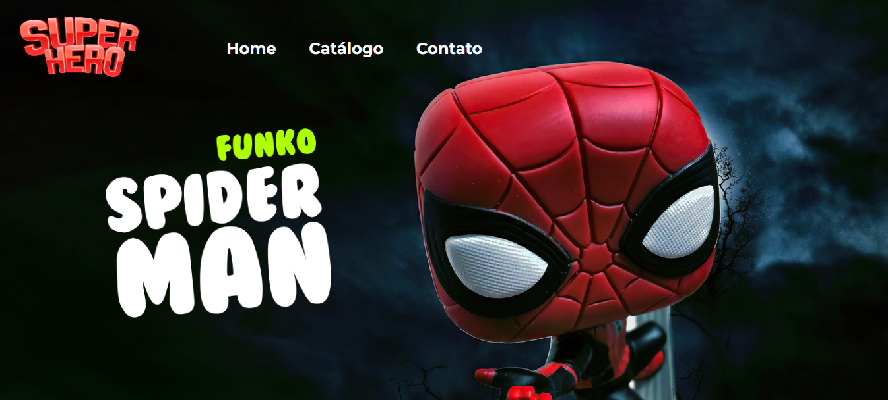

<h1 align="center">Loja de Bonecos - SuperHero</h1>

Um trabalho de Desenvolvimento Web do curso de Fullstack da Fullture School, usando HTML e CSS, com treino de flexbox e grid, para organização dos elementos visuais.

<p align="center">
      
</p>

<h3 align="center">
    <a href="https://rodrusantu-dev.github.io/LojaSuperHero/">Acessar a demonstração</a>
<h3 >


 ## Índice

- [Sobre](#-Sobre)
- [Pré-requisitos](#-Pré-requisitos)
- [Status do Projeto](#-Status-do-Projeto)

## 🔖&nbsp; Sobre

O projeto é de um loja de bonecos

## 📋 Pré-requisitos

De que coisas você precisa para instalar o software e como instalá-lo?

```
VS Code
Git
Github
```

## 🏁Status do Projeto

> Status do Projeto: Concluído :heavy_check_mark:
							     
## 🗂 Como baixar o projeto

```bash

    # Opção 01: Clonar o repositório
    $ git clone https://github.com/rodrusantu-dev/LojaSuperHero

    # Opção 02: Fazer o download do Projeto
    * Acessar via VS Code do seu computador.
```
	
## ⚙️ Executando os testes

Não houve necessidade de Teste de Software por ser aplicação HTML e CSS sem programação.

## 🛠️ Construído com

Mencione as ferramentas que você usou para criar seu projeto

* HTML5
* CSS3
* VSCode

## 📌 Versão

1.0 - Final do projeto do Módulo de HTML e CSS <br>

## 📄 Licença

Use a vondade o projeto e seus códigos, **desde que** seja sempre citado a fonte do Projeto.

## ✒️Autor
Feito com ❤️ por Rodrigo Menezes 👋🏽 Entre em contato!

 

## Licença
The MIT License (MIT)

Copyright ©️ 2023 - Loja Super Hero
